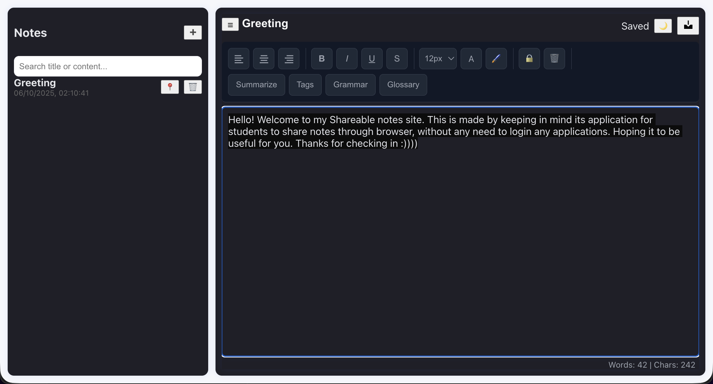
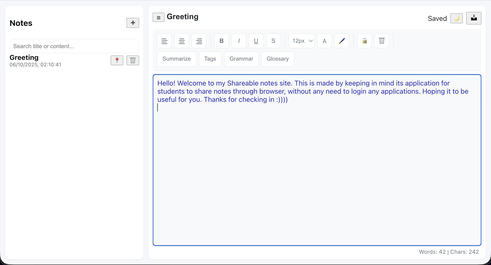

# Shareable Notes Application

This is a browser-based notes application built with **React** and **Vite**, featuring Supabase cloud storage, note encryption, and AI-powered tools such as summarization, tag suggestions, and grammar checking.

---

## Live Demo

**Deployed URL:** [https://shared-notes-app-het.netlify.app/](https://shared-notes-app-het.netlify.app/)

---

## Overview

Shareable Notes enables users to create, edit, and share notes seamlessly without requiring any sign-up or authentication.  
It is designed for students and professionals who need a lightweight, accessible note-sharing solution that runs entirely in the browser.

---

## Application Preview

### Dark Mode


### Light Mode


---

## Features

- Rich text editor with formatting tools (bold, italic, underline, alignment, font size)
- Full note management (create, edit, delete)
- Pin notes to the top
- Search by title or content
- Persistent storage using Supabase (PostgreSQL)
- Optional note encryption with password protection
- AI-powered features:
  - Note summarization
  - Automatic tag suggestions
  - Grammar correction
- Word and character count
- Export notes as `.txt`, `.pdf` and `.docx` files
- Dark and light theme toggle
- Responsive layout for all screen sizes

---

## Technology Stack

| Layer | Technology |
|--------|-------------|
| Frontend | React + Vite |
| Database | Supabase (PostgreSQL) |
| AI Integration | OpenAI API |
| Hosting | Netlify |
| Styling | Custom CSS |

---

## Setup and Installation

Follow these steps to run the project locally:

1. **Clone the repository**
   ```bash
   git clone https://github.com/HetShingala/shareable-notess.git
   cd shareable-notes

2. **Install dependencies**

   ```bash
   npm install
   ```

3. **Add environment variables**

   Create a `.env` file in the project root and add:

   ```bash
   VITE_SUPABASE_URL=your-supabase-url
   VITE_SUPABASE_ANON_KEY=your-supabase-anon-key
   VITE_OPENAI_API_KEY=your-openai-api-key
   ```

4. **Run the development server**

   ```bash
   npm run dev
   ```

5. **Build for production**

   ```bash
   npm run build
   ```

6. **Deploy**
   The project can be deployed easily via Netlify:

   ```bash
   netlify deploy --prod
   ```

---

## Database Schema (Supabase)

The application requires a table named `notes` with the following structure:

| Column     | Type      | Default             | Description                        |
| ---------- | --------- | ------------------- | ---------------------------------- |
| id         | uuid      | `gen_random_uuid()` | Primary key                        |
| user_id    | text      | —                   | User identifier                    |
| title      | text      | —                   | Note title                         |
| content    | text      | —                   | HTML content of the note           |
| encrypted  | bool      | false               | Indicates if the note is encrypted |
| iv         | text      | NULL                | Encryption IV (nullable)           |
| meta       | jsonb     | NULL                | Metadata such as timestamps        |
| pinned     | bool      | false               | Indicates if the note is pinned    |
| created_at | timestamp | `now()`             | Creation timestamp                 |
| updated_at | timestamp | `now()`             | Last updated timestamp             |

> **Row Level Security (RLS)** must be enabled with a permissive policy allowing all actions.

---

## AI Integration

The AI tools use the OpenAI API to enhance productivity:

* **Summarization:** Generates concise summaries for long notes.
* **Tag Suggestions:** Provides contextually relevant tags.
* **Grammar Checking:** Improves writing quality automatically.

---

## Example Note

> *"Hello! Welcome to my Shareable Notes site. This project is designed for students to easily create and share notes through their browser without requiring login or setup."*

---

## Security and Privacy

* Environment variables securely stored on Netlify.
* Row Level Security (RLS) enabled on Supabase.
* No authentication required for basic usage.
* Encrypted notes stored safely with optional password protection.

---

## Author

**Het Shingala**

Made with care for students and note-takers everywhere.

---

## License

This project is licensed under the **MIT License**.
You are free to use, modify, and distribute it with attribution.

---

If you find this project useful, consider giving it a ⭐ on GitHub.
